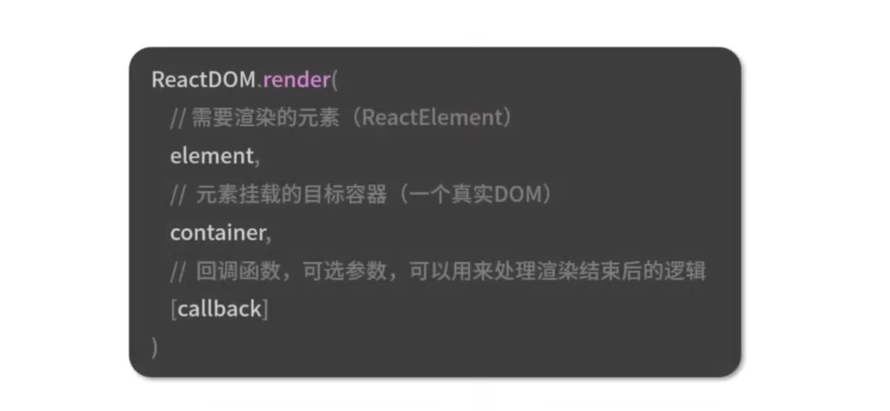

# 一、认识JSX
## 1.JSX的本质是什么？他和js的关系是什么？
JSX是Javascript 的一种语法扩展，它和模板语言很接近，但是它充分具备Javascript 的能力。

本质是JS的扩展，是生成createElement的语法糖，通过调用createElement去处理key，ref，等等，调用ReactElement去生成ReactElement

### ①认识 Babel-JSX 语法是如何在 JavaScript 中生效的：

JSX会被编泽为 React.createElement()， React.createElementl()将返回一个叫作“React Element” 的JS对象。Facebook 公司给 JSX 的定位是 Javascript的 “扩展”直接決定了浏览器并不会像天然支持 JavaScript 一样地支持 JSX

#### 什么是babel

Babel 是一个工具链，主要用于将 ECMAScript 2015+版本的代码转换为向后美容的 JavaScript 语法，以便能够运行在当前和旧饭本的河览器或其他环境中. ----Babel 官网

#### babel官网的使用

#### babel插件的原理

## 2.为什么要用JSX？不用会有什么后果？

### ① React 选用JSX语法的动机

代码复杂，嵌套过多，嵌套复杂

JSX 语法糖允许前端开发者，使用我们最为熟悉的类 HTML 标签语法来创建虚拟 DOM 在降低学习成本的同时，也提升了研发效率与研发体验

## 3.JSX是如何映射为DOM的

### ①createElement

#### 创建一个元素需要知道哪些信息？

#### 函数逻辑（格式化数据）

### ②ReactElement

#### 函数逻辑（组装ReactElement对象）

### ③ReactDOM.render

#### 入参规则

#### 函数逻辑

## 4.总结

# 二、操作JSX

## 1.ReactElement的结构

## 2.JSX的转换逻辑

jsx转为ReactElement的逻辑

## 3.Element的方法集

## 4.Children的方法集

## 5.Element对象的持久化

## 6.可控性渲染

# 三、JSX转换为Element的流程（课程实现）

# 四、Babel解析JSX