# 03生命周期

# 一、认识生命周期

## 1.生命周期方法的本质

组件的灵魂和躯干，render是灵魂，render 之外的生命周期方法可以理解为是组件的 “躯干”，〝躯干〞未必总是会做具体的事情，倘若 “躯干” 做了点什么往往都会直接或间接地影响到 “灵魂”

## 2.生命周期的设计思想

## 3.为什么react16要修改生命周期

### 要实现fiber

15的时候每次都是创建一个虚拟DOM树，然后两个树递归比较，递归是无法中断的

Fiber 是React 16 对 React 核心算法的一次重写 

Fiber 会使原本同步的渲染过程变成异步的

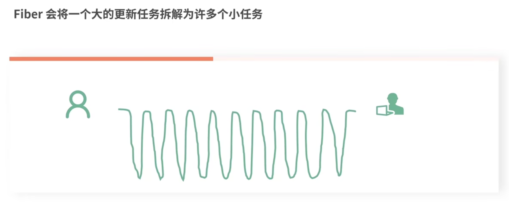

### 为什么要用 getDerivedStateFromProps 代替 componentWill ReceiveProps？

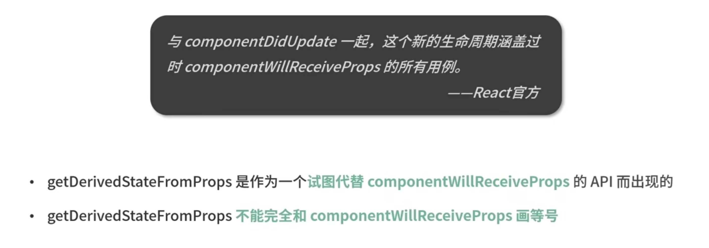

getDerivedStateFromProps 可以代替 componentwillReceiveProps 实现基于 props 派生 state

原则上来说getDerivedStateFromProps能做且只能做这一件事

### 消失的 componentwillupdate 与新增的getSnapshotBeforeupdate

## 4.什么是渲染工作流

指的是从组件数据改变到组件实际更新发生的过程

## 5.react15的生命周期

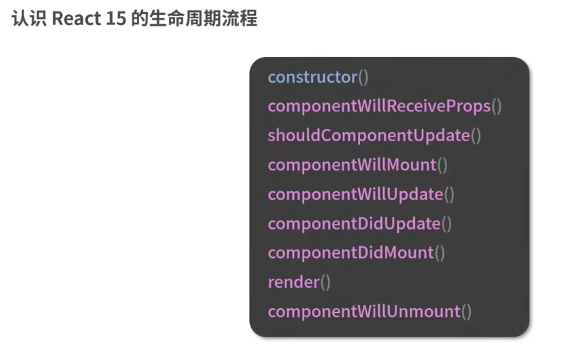

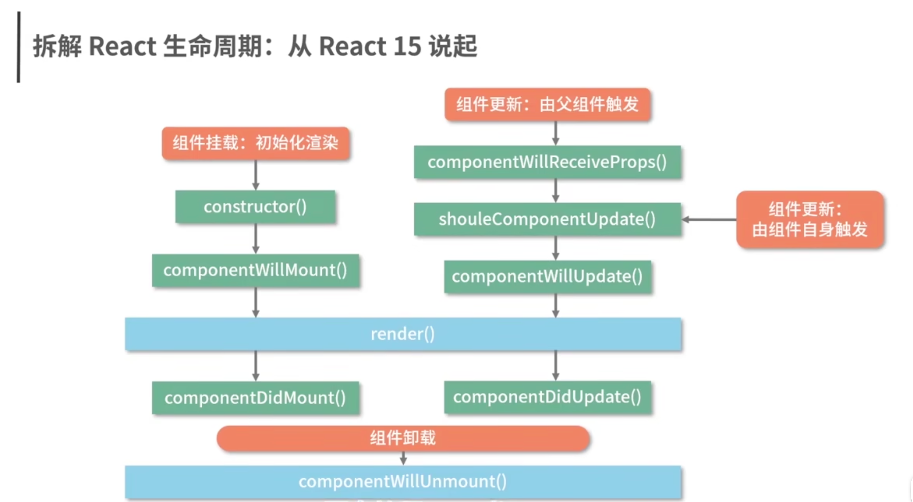

### 1.挂载

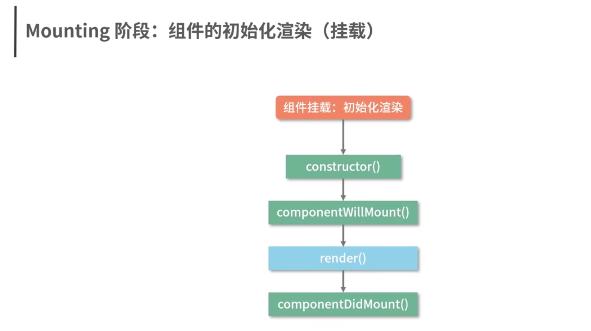

render 在执行过程中并不会去操作真实 DOM 它的职能是把需要渲染的内容返回出来

componentDidMount 方法在渲染结束后被触发真实 DOM 已经挂载到了页面上,可以在这个生命周期里执行真实 DOM 相关的操作

### 2.更新阶段

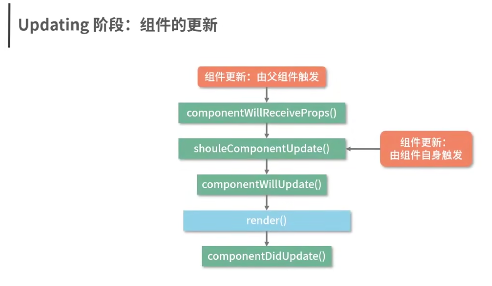

如果父组件导致组件重新渲染，即使props没有更改， 也会调用此方法 (componentReceiveProps) 。

如果只想处理更改，请确保进行当前值与交更值的比较。

componentReceiveProps 井不是由 props的变化触发的，而是由父组件的更新触发的

### 3.组件卸载

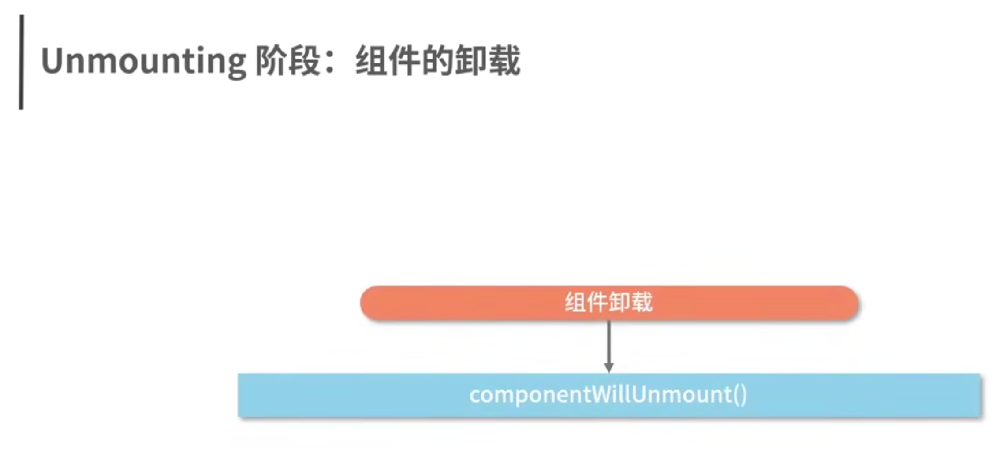

+ 组件在父组件中被移除了,组件中设置了 key 属性

+ 父组件在render 的过程中，发现 key 值和上一次不一致

## 6.react16生命周期

16.3

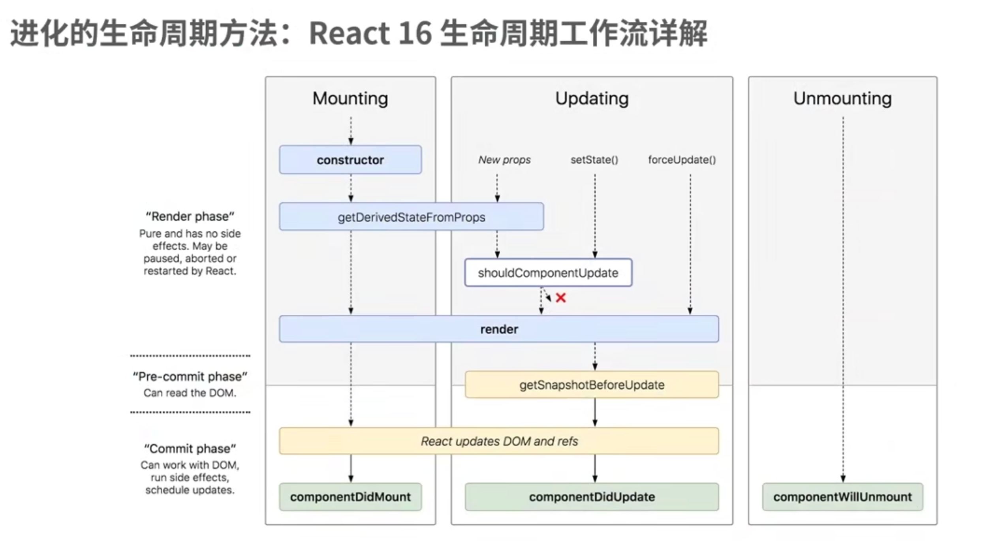

16.4+

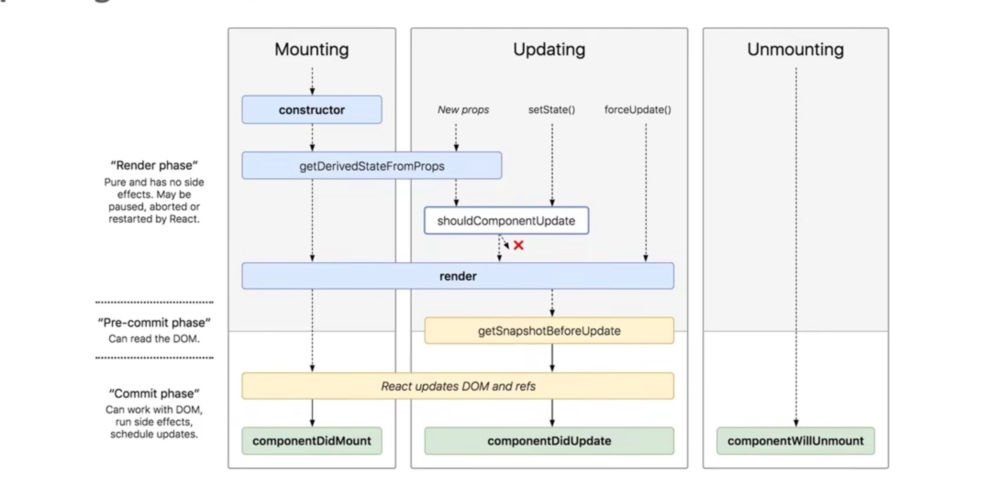

### 1.挂载

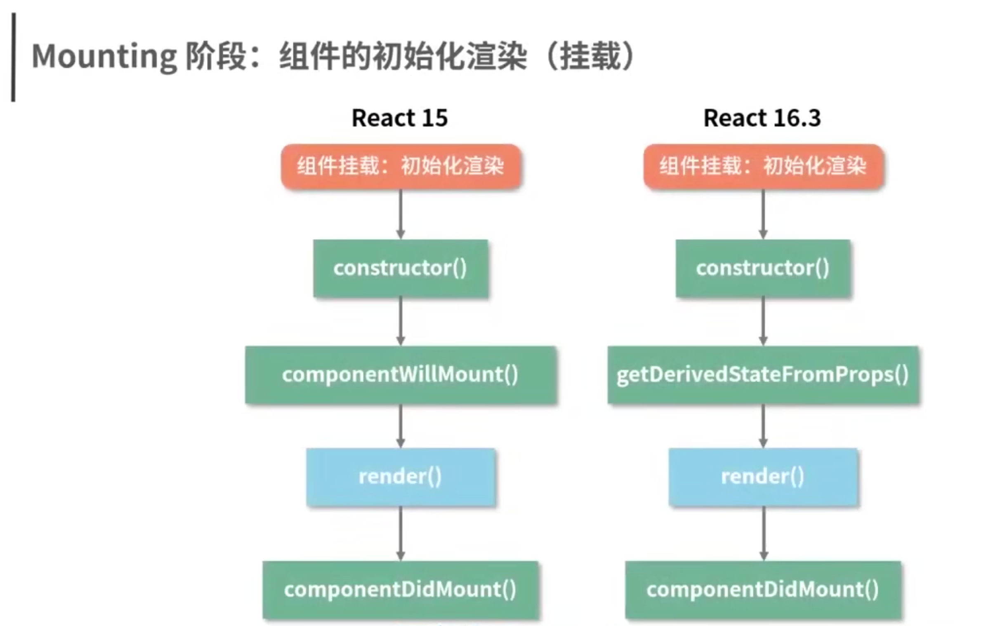

getDerivedStateFromProps 不是componentwillMount 的替代品

componentWillMount 的存在不仅 “鸡肋”而且危险因此它并不值得被 “代替”，它就应该被废弃

getDerivedStateFromProps 有且仅有一个用途：使用 props 来派生/更新 state, React 团队直接从命名层面约束了它的用途

getDerivedStateFromProps 在更新和挂载两个阶段都会“出镜”

静态方法无法是无法访问this的

getDerivedStateFromProps 需要一个对象格式的返回值

getDerivedState FromProps 方法对 state 的更新动作井非 “覆盖”式的更新，而是针对某个属性的定向更新

### 2.更新

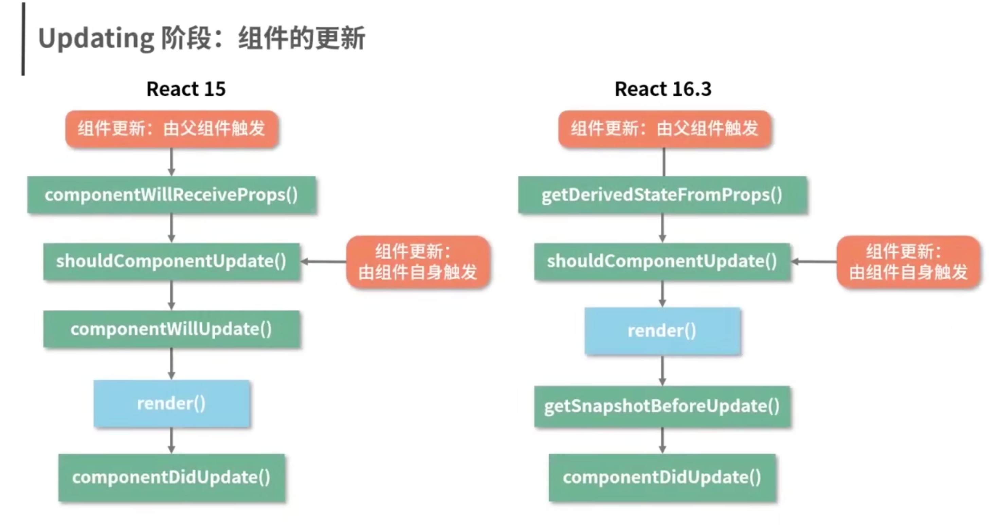

### 3.组件卸载

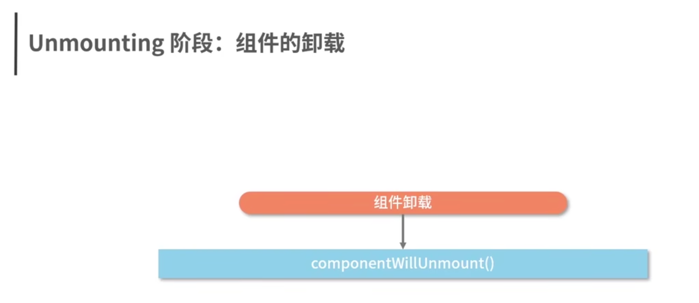

## 7.同步渲染&异步渲染

Fiber 架构的重要特征就是可以被打断的异步渲染模式根据 “能否被打断”这一标准

React 16 的生命周期被划分为了render 和commit 两个阶段

render 阶段在执行过程中允许被打断而 commit 阶段则总是同步执行的，因为render节点对用户来说是不可见的

render 阶段是允许暂停、终止和重启的，这就导致 render 阶段的生命周期都是有可能被重复执行的

### 为什么废弃will生命周期

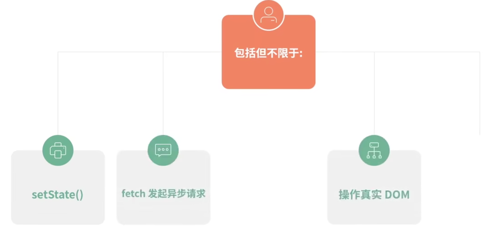

（1） 完全可以转移到其他生命周期（尤其是 componentDidxxx）里去做

异步请求再怎么快也快不过 (React 15 下）同步的生命周期首次渲染依然会在数据返回之前执行

(2） 在Fiber 带来的异步渲染机制下，可能会导致非常严重的Bug

由于render 阶段里的生命周期都可以重复执行在componentwillxxx 被打断＋ 重启多次后

就会发出多个付款请求

(3）即使你没有开启异步，React 15 下也有不少人能把自己“玩死”

React 16 改造生命周期的主要动机是为了配合 Fiber 架构带来的异步渲染机制

针对生命周期中长期被滥用的部分推行了具有强制性的最佳实践确保了 Fiber 机制下数据和视图的安全性，同时也确保了生命周期方法的行为更加纯粹、可控、可预测

# 类组件生命周期

# 函数组件生命周期

